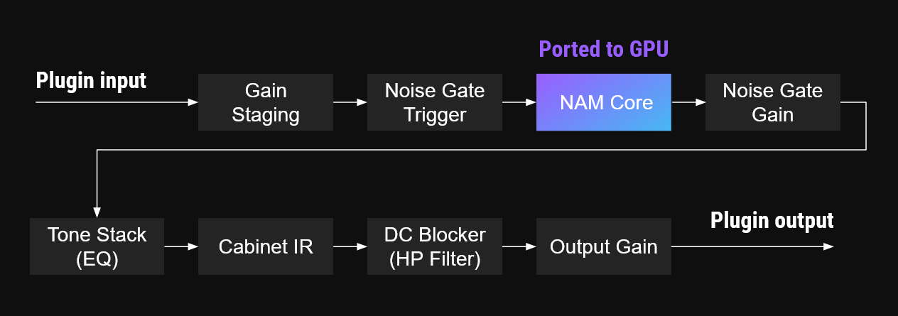
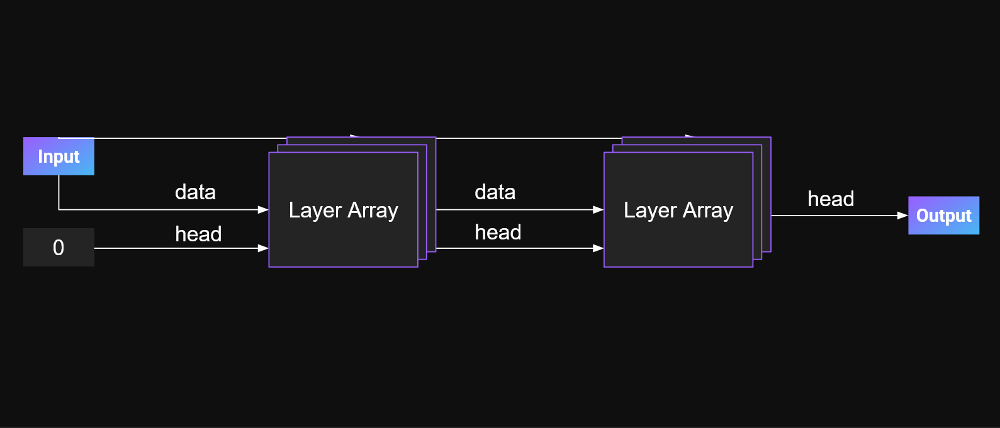
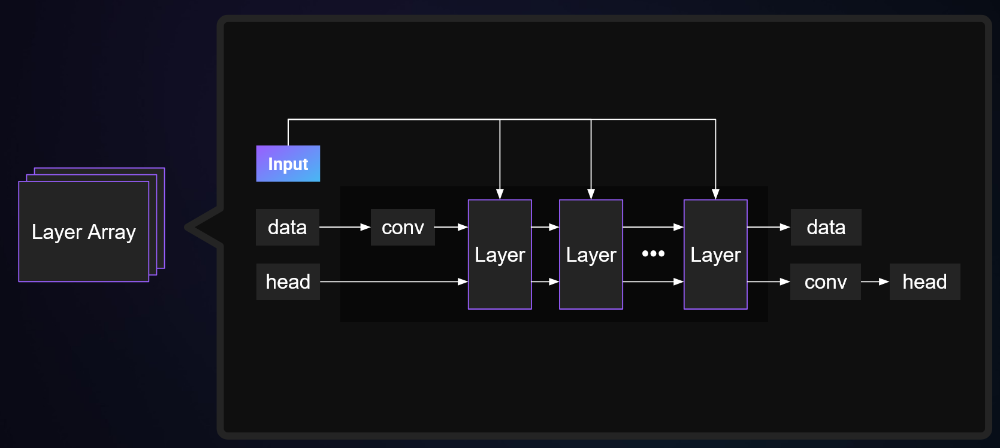
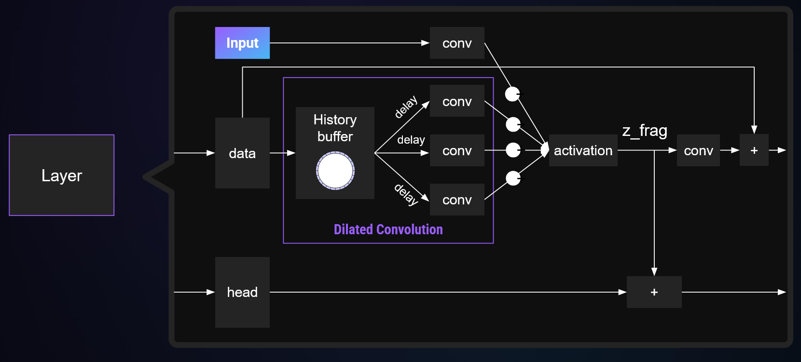

# Neural Amp Modeler Processor

The `nam_processor` is a parallelization of the Wavenet and LSTM models from the original Neural Amp Modeler Core [1]. Note that the this repository, similarly to Neural Amp Modeler Core, only implements the inference of the neural model, not the training nor the remainder of the plugin.

## Overview

Neural Amp Modeler (NAM) supports three distinct processing modes, each each varying in processing efficiency and accuracy.

The most straight forward model utilizes a convolutional neural network (ConvNet) model. This approach is based on a multi-layer perceptron structure that processed both current and past input samples to generate output. While functional, this design is computationally expensive and limited in its ability to accurately reproduce complex effects with constrained processing power.

The second model incorporated a Long Short-Term Memory (LSTM) cell, which introduces recurrent connections to maintain and utilize historical input information more effectively. By explicitly modeling temporal dependencies, this version achieves greater efficiency than the ConvNet-based approach while maintaining high-quality output. It limits parallel processing as the output of one sample depends on the previous sample.

The third and most widely used model is the WaveNet-based approach. It follows a hierarchical design that allows the propagation of previous information through multiple layers of processing resulting in output samples that can draw information from a long history of samples without explicitly going through all samples unlike the ConvNet approach.

## LSTM

LSTM is from the CPU perspective a very efficient model for NAM. It uses multiple LSTM cells and an increased number of 'channels' for the hidden state, i.e., after the initial LSTM cell. The LSTM cell follows that [standard design](https://ieeexplore.ieee.org/abstract/document/6795963) with the following components:

Long Short-Term Memory (LSTM) networks are a type of recurrent neural network (RNN) designed to handle long-term dependencies in sequential data. Unlike traditional RNNs, LSTM cells contain internal mechanisms called gates that regulate the flow of information, ensuring relevant signals are preserved while unnecessary data is discarded.

Each LSTM cell consists of:
- **Input Gate (i):** Controls how much new information is added to the cell state from the input.
- **Forget Gate (f):** Determines how much of the existing cell state should be retained.
- **Output Gate (o):** Modulates the cell state before passing it to the next time step.
- **Cell State (c):** Stores accumulated information over time, selectively updated by the input and forget gates.
- **Candidate Gate (g):** Generates new potential updates to the cell state.

The LSTM processes input data sequentially, updating the hidden state at each time step while considering previous context information. The primary advantage of LSTM is its ability to learn dependencies over extended sequences, making it well-suited for modeling temporal patterns in NAM.

### GPU Implementation

The LSTM model is parallelized through matrix-vector multiplication when processing a single time step. The computation of `i`, `f`, `o`, and `g` make up separate rows in the matrix; each output channel has four rows, one for each computation.

To optimize performance, multiple threads are assigned for processing each row, depending on matrix size. Within a warp, each row is computed in parallel, ensuring efficient utilization of GPU cores.

Since each time step requires a matrix-vector multiplication whose output is used in the next computation, parallelism across time steps is inherently limited. To mitigate this constraint and enhance performance, we process multiple time-domain samples per LSTM cell before advancing to the next step. This design allows us to keep weight matrices in registers, minimizing memory access overhead.

Intermediate and output data are stored in shared memory, balancing the trade-off between batch size and memory usage. The optimal configuration depends on available shared memory per block and the number of time-domain samples processed simultaneously. By carefully managing these resources, we achieve efficient execution of LSTM operations on the GPU.

## WaveNet

WaveNet is the most powerful and commonly adopted model for NAM. At its core, it leverages dilated convolutions to propagate information across time efficiently. Our implementation is directly based on the open-source WaveNet model, with modifications that replace neural network operations with optimized GPU-based equivalents. Importantly, we do not retrain the model—our approach ensures complete compatibility with existing CPU-based configurations.

The standard WaveNet architecture for NAM consists of two stacks of 10 convolutional layers. While our primary focus is on this architecture, our implementation remains flexible enough to accommodate different configurations.

### Understanding Dilated Convolutions

The WaveNet architecture was introduced in a [2016 paper by Aaron van den Oord et al](https://deepmind.google/discover/blog/wavenet-a-generative-model-for-raw-audio/), which has since been used in a large number of audio processing applications. One of its key advantages is that it operates directly on raw audio samples, eliminating the need for frequency-domain transformations such as FFTs or power spectrums.

In audio processing, many effects require access to a significant history of past samples—potentially thousands, given a sampling rate of 48,000 samples per second. A naive approach would necessitate vast computational resources and significant memory bandwidth to process such a large context window efficiently.

WaveNet's innovation lies in its hierarchical approach: rather than analyzing all past samples at once, it processes audio in stages, combining information from nearby samples before progressively merging these results with increasingly distant samples. This structure forms a computationally efficient tree, allowing information from the distant past to influence current outputs while reusing intermediate computations.

Dilated convolutions are the foundation of this hierarchical approach. However, to fully implement a functional WaveNet-based NAM model, additional components are required, which we will explore further in the following sections.

### Top Level

At a high level, we operate on small input sample buffers, typically 32, 64, or 128 samples. The current input data is fed into the first WaveNet block, referred to as a layer array in the NAM WaveNet model. The output of one layer array may be passed to another, and while two layer arrays are usually sufficient, additional layers can be used if necessary.

Additionally, the current input is forwarded to all layer arrays as auxiliary input. While NAM generally processes a single input channel, the layer arrays may operate with multiple channels—typically 8 or 16. In neural network terminology, these channels can capture different feature representations during the dilated convolution process.

The NAM WaveNet model refers to the data that propagates through the layer array as the "head," with new data continuously added on top of it.

### Layer Array

The layer array consists of multiple layers, each performing transformations on the input and head data. Initially, the input and head data are adjusted to match the channel count of the layer array before being processed by the first layer. The adjusted input is referred to as "data" in the model.

Each layer contains 1x1 convolution blocks, which are essential for refining and transforming the data. Every layer receives the original input, processes the data through these convolutions, and passes both data and head outputs to the next layer. The head output from the last layer is ultimately forwarded to the next layer array.

###  Layer Processing

The core processing occurs within each layer. Data is first stored in a ring buffer—a commonly used structure in delay line implementations—to ensure efficient access to previous samples required for dilated convolutions.

Unlike the CPU-based NAM model, which reinitializes a matrix upon overflow, our GPU-based implementation employs a ring buffer for optimized performance. The input data is stored in this buffer, allowing past data to be efficiently accessed during the convolution process.

Typically, each layer reads from the ring buffer three times, though this number is configurable. The delay intervals vary for each layer and can be dynamically adjusted. The retrieved data undergoes a 1x1 convolution before being combined with the transformed input data. The combined result is then passed through a non-linear activation function, such as ReLU, Sigmoid, or hyperbolic tangent (tanh), which enhances the model's expressive capability.

Finally, the processed data is passed through another convolution to generate the final data output. Simultaneously, an additional convolutional transformation is applied to generate the head output, which is then integrated into the next stage of the model.

This hierarchical layering forms the complete NAM WaveNet model, leveraging multiple stacked layers to extract features efficiently and produce high-quality audio processing results.

###  Building Blocks

The WaveNet model utilizes the following building blocks from `gpu_primitives`:
- A multichannel delay line to implement the ring buffer
- The `conv1x1` operation, which is used extensively
- Direct use of matrix multiplication operations, demonstrating how they can be leveraged in GPU-based processing

## Host Code Components

### NamModule
Implements the interface for the engine to create and destroy the processor.

### NamDeviceCodeProvider
Provides the engine access to the device binary, which is embedded in the processor binary.

### NamModuleInfoProvider
Implements the interfaces to query properties of the processor like name, id, version and supported GPU platforms. Also provides the engine with the names of the processor device functions.

### NamModuleLibrary
Defines the module export functions to create and destroy the NamModule, NamDeviceCodeProvider and NamModuleInfoProvider.

### NamInputPort
Implements the input to the processor. Provides functionality to connect, disconnect or update inputs to the processor.

### Gpu[LSTM|Wavenet]Setters
Contain setters that initialize [LSTM|Wavenet] network parameters on the CPU, such that we can initialize the GPU data from the host with a single copy of the memory block.

### NamProcessor
This is the host-side of the processor and implements the processor interface. Configures the execution of the processor and provides parameters for the GPU tasks.

## Device Code Components

## ScrambledNames
Defines the names for device function substitution to avoid name conflicts between processors, see `processor_utilities` for details.

### Properties
Contains user-defined parameter structs, which are passed to the processor functions to control the behavior of the processor.

### Gpu[LSTM|Wavenet]
Implementation of the GPU [LSTM|Wavenet] structures with the device processing functions.

Note that compile-time optimizations are used to tailor the code for specific configurations.
The exact functions generated can be found in `NamProcessor.cuh` and `NamProcessor.cu`.
The most influential parameters for runtime performance are input buffer size and thread count, both of which can be adjusted to experiment with different settings.

Increasing the buffer size and thread count generally results in higher parallelism and throughput, but may also lead to increased latency.
Additionally, using more resources may negatively affect execution performance if the hardware is pushed beyond its optimal capacity.

The corresponding task functions for the selected setup are defined in `NamProcessor.cpp` within the `setup` and `get_entry_index` functions.
If changes are made to the compilation setup in `NamProcessor.cuh` and `NamProcessor.cu`, the task function selections in `NamProcessor.cpp` must be adjusted accordingly.

Beyond buffer size and thread count, the architecture of the models themselves can be tweaked, such as modifying the number of layers and hidden sizes.
These adjustments are already considered during model training, and only a matching model configuration can be loaded.

For the Wavenet architecture, a list of available models is found in the `WavenetModelConfigs.h` file.
By default, the `GenericWavenetConfig` is used, as indicated in the `ProcessWavenetFunc` macro within `NamProcessor.cuh`. For model builder definitions, see `GpuWavenet.h`.

For the LSTM architecture, the `GenericLSTMConfig` model is defined in the `GpuLstm.h` file. It has a default maximum of `4` layers and a single-dimensional input (mono audio).
The hidden size, which refers to the dimensionality of the intermediate state, is a template parameter to the model.

## SimplifiedContext
Simple wrapper for a context that strips down functionality to what is actually required in the `nam_processor`. Provides a block with block-index, thread indices, block dimensions, a synchronization function, access to shared memory...

### NamProcessor.cuh
The device side implementation of the processor. Defines the GPU processor and its tasks, i.e., the processing functions.

[1] https://github.com/sdatkinson/NeuralAmpModelerCore
